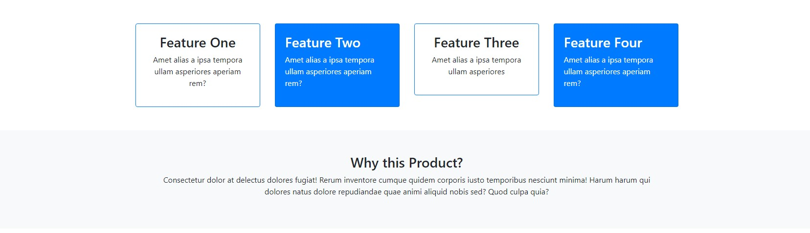
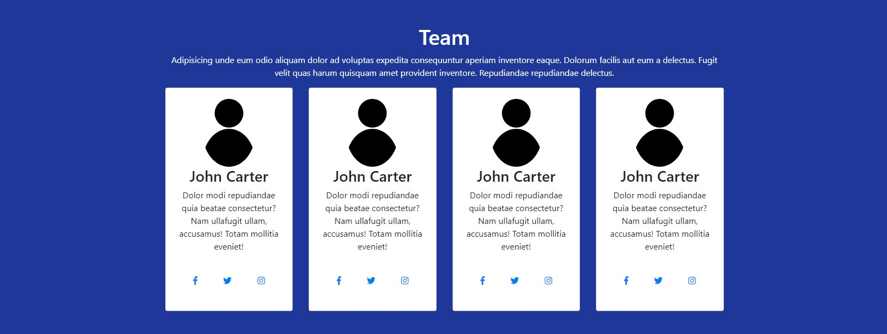
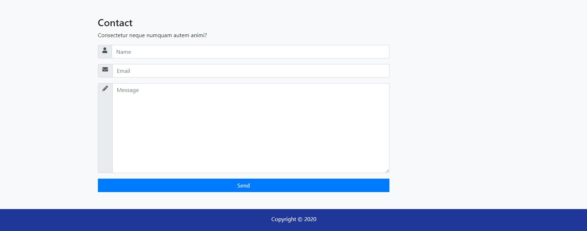

#Landing Page con Bootstrap

Pagina web realizada con bootstrap

## GitHub Page

Puedes apreciar la web final a través de [Página Web](https://samuelantunez.github.io/landing-page/)






## Herramientas

Para este proyecto se utilizarón las siguientes herramientas

* [Google Fonts](https://fonts.google.com/)
* [Bootstrap](https://getbootstrap.com/)


## Instalación

[Descargamos](https://github.com/SamuelAntunez/landing-page/archive/gh-pages.zip) o clonamos el proyecto a través del siguiente comando

```
git clone https://github.com/SamuelAntunez/landing-page.git
```
## Version

1.0.0

## Expresiones de Gratitud
Este proyecto se realizo gracias al trabajo base de: 
</br>[<br/><sub><b>Fazt</b></sub>](https://github.com/FaztTech)
